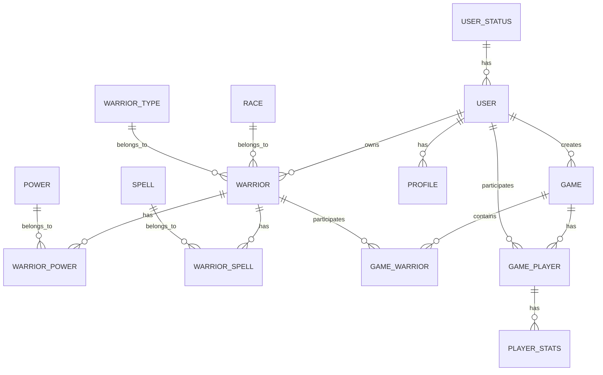

# Documentación de la Base de Datos

## Diagrama ER

## Tablas

### USER_STATUS
Tabla que almacena los estados posibles de un usuario.

| Campo | Tipo | Descripción |
|-------|------|-------------|
| user_status_id | INT | PK, Identificador único |
| user_status_name | VARCHAR(50) | Nombre del estado |
| user_status_description | VARCHAR(255) | Descripción del estado |
| created_at | DATETIME | Fecha de creación |
| updated_at | DATETIME | Fecha de actualización |

### USER
Tabla que almacena la información de los usuarios.

| Campo | Tipo | Descripción |
|-------|------|-------------|
| user_id | INT | PK, Identificador único |
| user_user | VARCHAR(50) | Nombre de usuario |
| user_password | VARCHAR(255) | Contraseña hasheada |
| user_status_id | INT | FK a USER_STATUS |
| created_at | DATETIME | Fecha de creación |
| updated_at | DATETIME | Fecha de actualización |

### RACE
Tabla que almacena las razas disponibles.

| Campo | Tipo | Descripción |
|-------|------|-------------|
| race_id | INT | PK, Identificador único |
| name | VARCHAR(50) | Nombre de la raza |
| description | VARCHAR(255) | Descripción de la raza |
| strength | INT | Fuerza base de la raza |
| defense | INT | Defensa base de la raza |
| speed | INT | Velocidad base de la raza |
| intelligence | INT | Inteligencia base de la raza |
| created_at | DATETIME | Fecha de creación |
| updated_at | DATETIME | Fecha de actualización |

### WARRIOR_TYPE
Tabla que almacena los tipos de guerrero.

| Campo | Tipo | Descripción |
|-------|------|-------------|
| warrior_type_id | INT | PK, Identificador único |
| name | VARCHAR(50) | Nombre del tipo |
| description | VARCHAR(255) | Descripción del tipo |
| base_strength | INT | Fuerza base del tipo |
| base_defense | INT | Defensa base del tipo |
| base_speed | INT | Velocidad base del tipo |
| base_intelligence | INT | Inteligencia base del tipo |
| created_at | DATETIME | Fecha de creación |
| updated_at | DATETIME | Fecha de actualización |

### WARRIOR
Tabla que almacena los guerreros.

| Campo | Tipo | Descripción |
|-------|------|-------------|
| warrior_id | INT | PK, Identificador único |
| name | VARCHAR(50) | Nombre del guerrero |
| race_id | INT | FK a RACE |
| warrior_type_id | INT | FK a WARRIOR_TYPE |
| strength | INT | Fuerza del guerrero |
| defense | INT | Defensa del guerrero |
| speed | INT | Velocidad del guerrero |
| intelligence | INT | Inteligencia del guerrero |
| status | VARCHAR(20) | Estado del guerrero |
| created_at | DATETIME | Fecha de creación |
| updated_at | DATETIME | Fecha de actualización |

### POWER
Tabla que almacena los poderes disponibles.

| Campo | Tipo | Descripción |
|-------|------|-------------|
| power_id | INT | PK, Identificador único |
| name | VARCHAR(50) | Nombre del poder |
| description | VARCHAR(255) | Descripción del poder |
| percentage | INT | Porcentaje de efectividad |
| created_at | DATETIME | Fecha de creación |
| updated_at | DATETIME | Fecha de actualización |

### SPELL
Tabla que almacena los hechizos disponibles.

| Campo | Tipo | Descripción |
|-------|------|-------------|
| spell_id | INT | PK, Identificador único |
| name | VARCHAR(50) | Nombre del hechizo |
| description | VARCHAR(255) | Descripción del hechizo |
| percentage | INT | Porcentaje de efectividad |
| created_at | DATETIME | Fecha de creación |
| updated_at | DATETIME | Fecha de actualización |

### WARRIOR_POWER
Tabla de relación entre guerreros y poderes.

| Campo | Tipo | Descripción |
|-------|------|-------------|
| warrior_id | INT | FK a WARRIOR |
| power_id | INT | FK a POWER |
| created_at | DATETIME | Fecha de creación |
| updated_at | DATETIME | Fecha de actualización |

### WARRIOR_SPELL
Tabla de relación entre guerreros y hechizos.

| Campo | Tipo | Descripción |
|-------|------|-------------|
| warrior_id | INT | FK a WARRIOR |
| spell_id | INT | FK a SPELL |
| created_at | DATETIME | Fecha de creación |
| updated_at | DATETIME | Fecha de actualización |

### PROFILE
Tabla que almacena los perfiles de usuario.

| Campo | Tipo | Descripción |
|-------|------|-------------|
| profile_id | INT | PK, Identificador único |
| user_id | INT | FK a USER |
| profile_name | VARCHAR(50) | Nombre del perfil |
| profile_description | VARCHAR(255) | Descripción del perfil |
| created_at | DATETIME | Fecha de creación |
| updated_at | DATETIME | Fecha de actualización |

### GAME
Tabla que almacena las partidas.

| Campo | Tipo | Descripción |
|-------|------|-------------|
| game_id | INT | PK, Identificador único |
| game_name | VARCHAR(50) | Nombre de la partida |
| game_status | VARCHAR(20) | Estado de la partida |
| created_by | INT | FK a USER |
| created_at | DATETIME | Fecha de creación |
| updated_at | DATETIME | Fecha de actualización |

### GAME_WARRIOR
Tabla que almacena los guerreros en una partida.

| Campo | Tipo | Descripción |
|-------|------|-------------|
| game_warrior_id | INT | PK, Identificador único |
| game_id | INT | FK a GAME |
| warrior_id | INT | FK a WARRIOR |
| health | INT | Salud del guerrero |
| position | INT | Posición en la partida |
| created_at | DATETIME | Fecha de creación |
| updated_at | DATETIME | Fecha de actualización |

### GAME_PLAYER
Tabla que almacena los jugadores en una partida.

| Campo | Tipo | Descripción |
|-------|------|-------------|
| game_player_id | INT | PK, Identificador único |
| game_id | INT | FK a GAME |
| user_id | INT | FK a USER |
| player_status | VARCHAR(20) | Estado del jugador |
| created_at | DATETIME | Fecha de creación |
| updated_at | DATETIME | Fecha de actualización |

### PLAYER_STATS
Tabla que almacena las estadísticas de los jugadores.

| Campo | Tipo | Descripción |
|-------|------|-------------|
| player_stats_id | INT | PK, Identificador único |
| user_id | INT | FK a USER |
| games_played | INT | Partidas jugadas |
| games_won | INT | Partidas ganadas |
| games_lost | INT | Partidas perdidas |
| created_at | DATETIME | Fecha de creación |
| updated_at | DATETIME | Fecha de actualización |

## Índices

### USER
- PRIMARY KEY (user_id)
- UNIQUE KEY (user_user)
- INDEX (user_status_id)

### WARRIOR
- PRIMARY KEY (warrior_id)
- UNIQUE KEY (name)
- INDEX (race_id)
- INDEX (warrior_type_id)

### GAME
- PRIMARY KEY (game_id)
- INDEX (created_by)
- INDEX (game_status)

### GAME_WARRIOR
- PRIMARY KEY (game_warrior_id)
- INDEX (game_id)
- INDEX (warrior_id)

### GAME_PLAYER
- PRIMARY KEY (game_player_id)
- INDEX (game_id)
- INDEX (user_id)

## Restricciones

### Claves Foráneas
- USER.user_status_id -> USER_STATUS.user_status_id
- WARRIOR.race_id -> RACE.race_id
- WARRIOR.warrior_type_id -> WARRIOR_TYPE.warrior_type_id
- WARRIOR_POWER.warrior_id -> WARRIOR.warrior_id
- WARRIOR_POWER.power_id -> POWER.power_id
- WARRIOR_SPELL.warrior_id -> WARRIOR.warrior_id
- WARRIOR_SPELL.spell_id -> SPELL.spell_id
- PROFILE.user_id -> USER.user_id
- GAME.created_by -> USER.user_id
- GAME_WARRIOR.game_id -> GAME.game_id
- GAME_WARRIOR.warrior_id -> WARRIOR.warrior_id
- GAME_PLAYER.game_id -> GAME.game_id
- GAME_PLAYER.user_id -> USER.user_id
- PLAYER_STATS.user_id -> USER.user_id

### Restricciones de Datos
- USER_STATUS.user_status_name: NOT NULL, UNIQUE
- USER.user_user: NOT NULL, UNIQUE
- USER.user_password: NOT NULL
- RACE.name: NOT NULL, UNIQUE
- WARRIOR_TYPE.name: NOT NULL, UNIQUE
- WARRIOR.name: NOT NULL, UNIQUE
- POWER.name: NOT NULL, UNIQUE
- SPELL.name: NOT NULL, UNIQUE
- GAME.game_name: NOT NULL
- GAME.game_status: NOT NULL, ENUM('waiting', 'in_progress', 'finished')
- GAME_WARRIOR.health: NOT NULL, >= 0
- GAME_PLAYER.player_status: NOT NULL, ENUM('active', 'inactive', 'eliminated')
- PLAYER_STATS.games_played: NOT NULL, >= 0
- PLAYER_STATS.games_won: NOT NULL, >= 0
- PLAYER_STATS.games_lost: NOT NULL, >= 0 